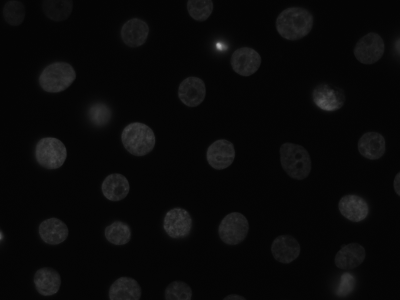
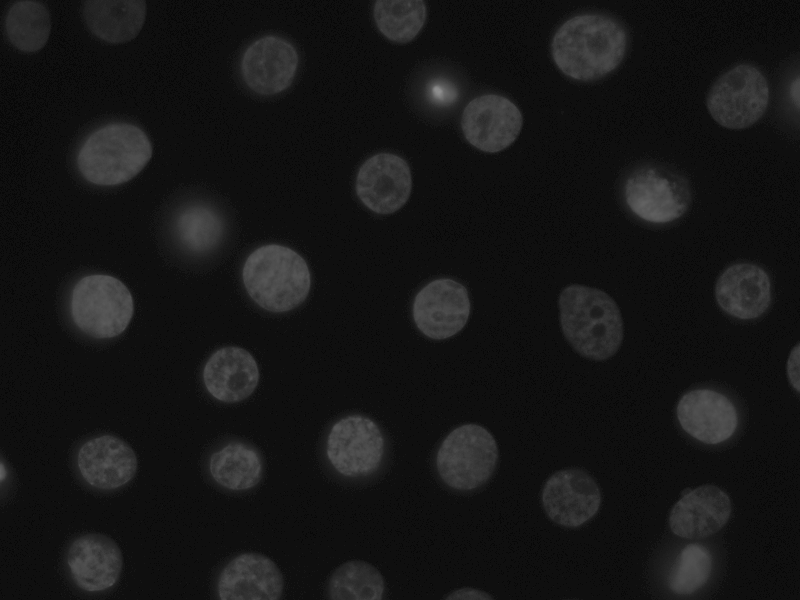
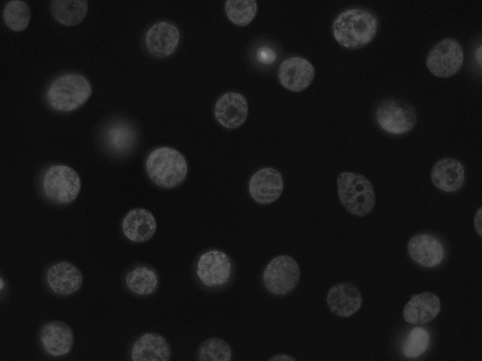
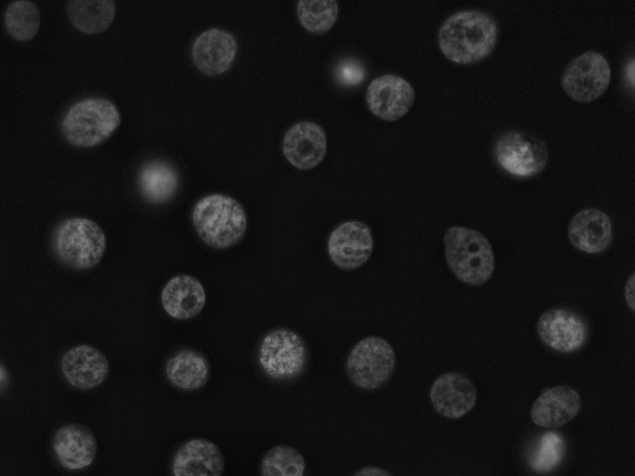
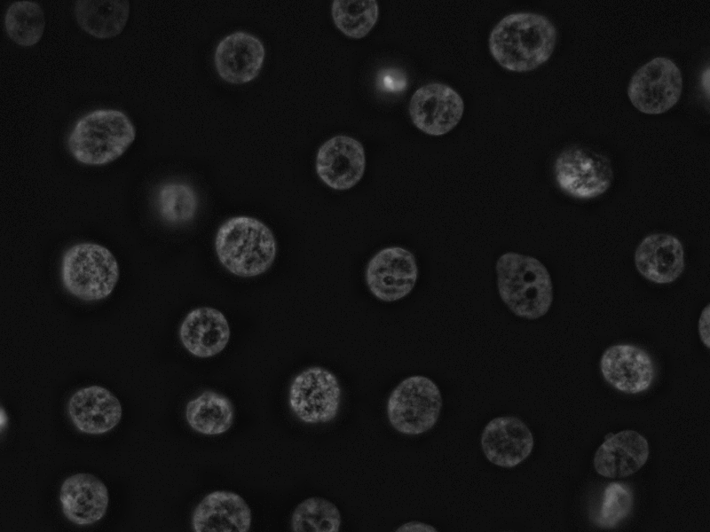

Cython interface to CLAHE (Graphics Gems IV)
==================================

This is a cython wrapper for the C code of CLAHE (Contrast Limited Adaptive
Histogram Equalization), available from "Graphics Gems IV". This is an
alternative to contrast-stretch, it slides a window over the image and locally
stretches the contrast while respecting a constraint on authorized gradient
jumps.

Example
-------

``python example.py``        

Raw image and simple contrast-stretch:        
 &nbsp; 

CLAHE with 2x2 window:     

CLAHE with 5x5 window:     

CLAHE with 20x20 window:     

CLAHE with 50x50 window:     

Reference
---------
ANSI C code from the article         
"Contrast Limited Adaptive Histogram Equalization"        
by Karel Zuiderveld, karel@cv.ruu.nl       
in "Graphics Gems IV", Academic Press, 1994       
